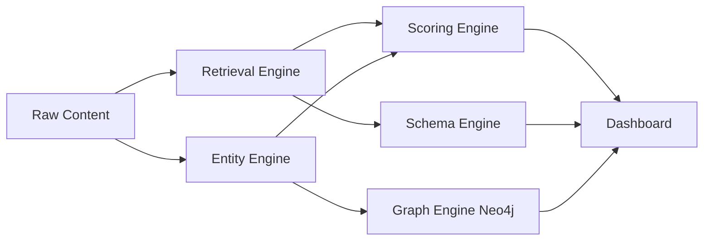

# AI SEO OS
Production-grade AI SEO Operating System for retrieval optimization, semantic structuring, unified JSON-LD schema compilation, and GraphRAG knowledge graph generation.

## Architecture

## Install
1. `pnpm install`
2. `cp .env.example .env`
3. `pnpm prisma:generate`
4. `pnpm dev`

## Deployment
- **Docker**: `docker compose -f docker/docker-compose.yml up --build`
- **Vercel**: import repository, set env vars from `.env.example`, deploy.

## AI SEO Outputs
- AI Retrieval Executive Summary
- Semantic article structure
- Retrieval-optimized chunks
- Entity mapping matrix
- Nested JSON-LD `@graph`
- Conversational FAQ layer
- AI readiness & citation score
- Neo4j knowledge graph visualization

## Methodology
- Retrieval chunks (100-150 words target) with ambiguity controls.
- Entity salience + relation modeling.
- Unified JSON-LD graph compiler with persistent `@id` links.
- Composite AI readiness score; content below 80/100 rejected.
- Trust graph with author/reviewedBy/organization/sameAs links.
